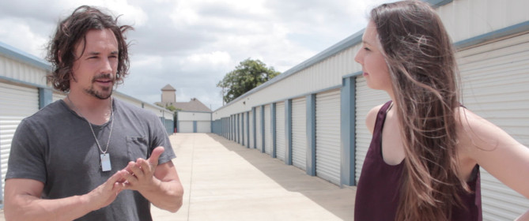

# The Heir

## Inheriting a storage unit full of family heirlooms forces an estranged son to confront his place in the family.

*The Heir* is an independent feature film in active development in 2018.
In addition to what we hope is a compelling story, the project is an experiment in applying collaborative, agile methodologies to film.

## TL;DR:  [Skip the methodology, read the story](https://github.com/arikrupnik/the-heir/releases/download/v0.1.0/heir-structure.pdf).

Agile is a common approach in software development but may be new to some filmmakers.
The big ideas in Agile are around individuals, collaboration and espousing change.

Filmmakers sometimes describe production as a rather linear process, like Bogart and Hepburn sailing down a series of waterfalls in *The African Queen*:

    screenplay -> casting -> shooting -> editing -> sound -> effects -> music

In our experience, the process seldom proceeds this way.
Actors, once cast, have suggestions about their characters' dialogue.
Locations rarely match the screenplay.
Sound editors find the audio unusable.
We can fix these problems: re-write, re-shoot, re-record; but the fixes are expensive.
We treat each change as an aberration, a feat akin to [salmon jumping up a waterfall](https://wwwdotgrantwilsondotcom.files.wordpress.com/2012/10/grizzly-bear-eating-salmon-photo01.jpg).

Agile process espouses change, and invites everyone's input early.
Instead of throwing a complete screenplay at actors, we involve them in writing their characters' dialogue.
Instead of asking camera and sound departments to make a location work, we involve them in location scouting.
Instead of asking a composer to score a complete film, we compose themes as we write the screenplay, so by the time we get to filming, actors know what their scenes sound like.
The development process becomes a spiral rather than a straight line.

Getting feedback early and continuously is key to our process.
Everyone on the production has access to every draft of the screenplay and other documents such as location scouting photos.
Anyone on the production can propose an edit to any of these documents.
But we go farther.
We make our production materials available to anyone who wants to look, right here on GitHub.
We welcome public review of screenplay drafts.
Once we start shooting, we plan to make dailies available on YouTube.
Our goal is to delight our audience.
The sooner we know what our audience thinks of our work, the closer we can come to our goal.

*The Heir* is a compact production we're using to validate this process.
The story is set in one location and relies on dialog and character development.
Target running time is 90 minutes.
We invite you to review [the treatment](https://github.com/arikrupnik/the-heir/releases/download/v0.1.0/heir-structure.pdf) and follow [the screenplay source](the-heir.fountain) as we develop it.

We invite your feedback on both the story and the process!
